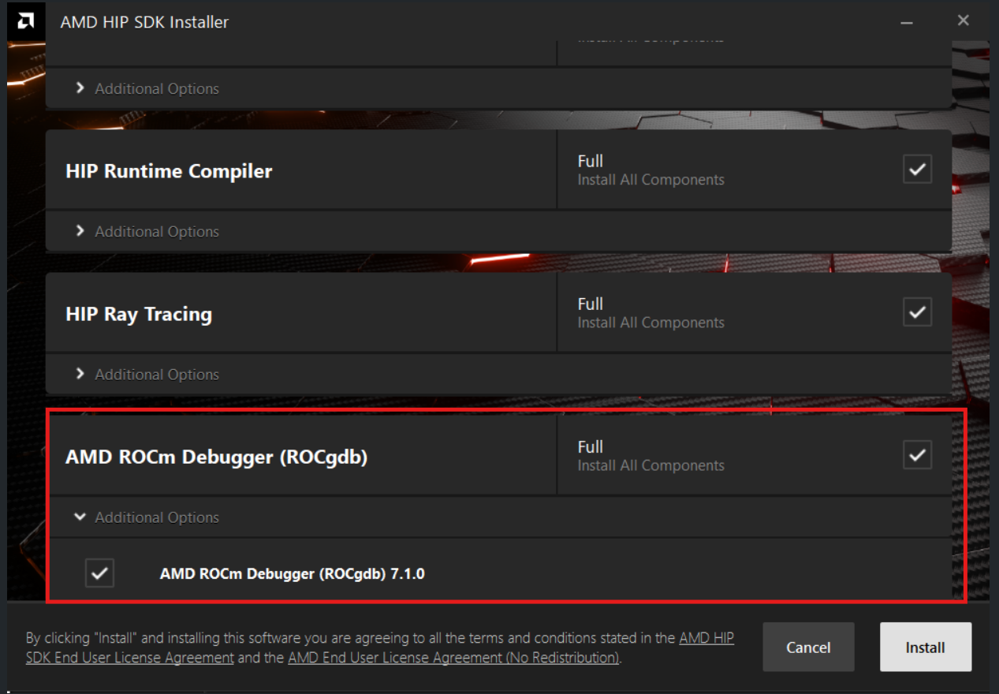

.. meta::
   :description: Install HIP SDK
   :keywords: Windows, install, HIP, SDK, ROCm, AMD, HIP SDK

.. _hip-install-full:

*******************************************************************
AMD ROCm Debugger for Windows
*******************************************************************

.. _system-requirements:

Prerequisites
=============

Windows ROCgdb is included in the HIP SDK installer from version 7.1.1. Supported SKUs can be found here: :doc:`System requirements <../reference/system-requirements>` . For ROCgdb to functional properly in the preview release, the driver included with the HIP SDK package must be used.

Installation
============

Windows ROCgdb can be installed by checking the “AMD ROCm Debugger (ROCgdb)” option (see below) during installation of the HIP SDK package.

Limitations
===========

ROCgdb on Windows has the following limitations currently:

* Windows is supported only on the ``gfx120x`` architectures (``gfx1200`` and ``gfx1201``).

* Multi-GPU configurations involving more than one AMD GPU are not supported.

* Generating or loading AMD GPU core dumps is not supported on Windows.

* Python scripting is not supported.

* Due to an AMD HIP runtime limitation, it is not possible to pass intercepted signals (``SIGFPE``, ``SIGSEGV``, etc.) to the inferior, even if the user requests otherwise. Signals are always suppressed by the runtime.

* The HIPCC compiler on Windows defaults to producing PDB files containing CodeView debug information for the host code. ROCgdb does not support this debug format. To enable host code debugging, pass the ``-gdwarf -Wl,-debug:dwarf`` options to HIPCC to generate DWARF debug information instead, which ROCgdb supports.

* The HIPCC compiler on Windows emits host code that targets the Microsoft x64 ABI conventions and MSVC C++ ABI. ROCgdb does not fully support these, which may lead to incorrect symbol names, misprinted C++ objects, and similar issues when debugging host code. These limitations do not affect debugging AMD GPU device-side code.

Hello World example
===================

Debugging GPU code with ROCgdb on Windows is just like on Linux, as you’ll see with this example.

1.  Copy the following code to a file named ``example.cpp`` in a directory of your choice (for example, ``C:\rocgdb-example``). The code contains a simple GPU kernel that adds two integers and returns the result. The result is printed on the console.

    .. code-block:: c++

        #include <hip/hip_runtime.h>
        #include <assert.h>

        __global__ void do_an_addition(int a, int b, int *out)
        {
          *out = a + b;
        }

        int main ()
        {
          int *result_ptr, result;
          /* Allocate memory for the device to write the result to. */
          hipError_t error = hipMalloc(&result_ptr, sizeof(int));
          assert(error == hipSuccess);

          /* Run `do_an_addition` on one block containing one HIP thread. */
          do_an_addition<<<dim3(1), dim3(1), 0, 0>>>(1, 2, result_ptr);

          /* Copy result from device to host. This acts as a
             synchronization point, waiting for the kernel dispatch to
             complete. */
          error = hipMemcpyDtoH(&result, result_ptr, sizeof(int));
          assert(error == hipSuccess);

          printf("result is %d\n", result);
          assert(result == 3);
          return 0;
        }

2.  Open a Windows Command Prompt. We will use this prompt to run the compiler and the debugger.

3.  Put the HIP SDK bin directory in the PATH:

    .. code-block:: console

        set "HIP_SDK_DIR=C:\Program Files\AMD\ROCm\7.1"
        set "PATH=%HIP_SDK_DIR%\bin;%PATH%"

4.  This makes the ``hipcc`` and ``rocgdb`` programs available in the PATH.

5.  Switch the current directory to where you put the ``example.cpp`` source file earlier:

    .. code-block:: console

        cd C:\rocgdb-example

6.  Compile the ``example.cpp`` HIP program using ``hipcc``:

    .. code-block:: console

        C:\rocgdb-example>hipcc example.cpp -o example.exe --offload-arch=gfx1201 -gdwarf -Wl,-debug:dwarf -O0

    Notes:

    - The ``--offload-arch=gfx1201`` option targets AMD Radeon RX 9070 series products.  For AMD Radeon RX 9060 series products, use ``--offload-arch=gfx1200`` instead.
    - The ``-gdwarf -Wl,-debug:dwarf`` options instruct ``hipcc`` to emit DWARF debug information for the host code. Otherwise, ``hipcc`` emits PDB (Microsoft) debug information, which ROCgdb does not yet understand.
    - The ``-O0`` option disables compiler optimizations.

7.  Run the just-compiled program to confirm it is working:

    .. code-block:: console

        C:\rocgdb-example>.\example.exe
        result is 3

8. You can now run the just-compiled program under ROCgdb, stopping execution in the ``do_an_addition`` GPU kernel function, like so:

    .. code-block:: console

        C:\rocgdb-example>rocgdb example.exe

        GNU gdb (ROCm) 18.0.50.20251029-git
        Copyright (C) 2025 Free Software Foundation, Inc.
        License GPLv3+: GNU GPL version 3 or later <http://gnu.org/licenses/gpl.html>
        This is free software: you are free to change and redistribute it.
        There is NO WARRANTY, to the extent permitted by law.
        Type "show copying" and "show warranty" for details.
        This GDB was configured as "x86_64-w64-mingw32".
        Type "show configuration" for configuration details.
        For bug reporting instructions, please see:
            <https://github.com/ROCm-Developer-Tools/ROCgdb/issues>.
        Find the GDB manual and other documentation resources online at:
            <http://www.gnu.org/software/gdb/documentation/>.
        For help, type "help".
        Type "apropos word" to search for commands related to "word"...
        Reading symbols from example.exe...
        (gdb) break do_an_addition
        Function "do_an_addition" not defined.
        Make breakpoint pending on future shared library load? (y or [n]) y
        Breakpoint 1 (do_an_addition) pending.
        (gdb) run
        Starting program: C:\rocgdb-example\example.exe
        [New Thread 12180.0x286c]
        [New Thread 12180.0x1aa4]
        [New Thread 12180.0x4e8c]
        [New Thread 12180.0x3578]
        [New Thread 12180.0x3af4]
        [Switching to thread 7, lane 0 (AMDGPU Lane 1:2:1:1/0 (0,0,0)[0,0,0])]
        Thread 7 "do_an_addition" hit Breakpoint 1, with lane 0, do_an_addition (a=1, b=2, out=0x300004000) at example.cpp:6
        6         *out = a + b;
        (gdb)

That’s all there is to it. You can find more information about ROCgdb in the copy of the ROCgdb manual that is installed with the HIP SDK. The manual is located under the ``share\html`` subdirectory, for example, for an SDK installed at ``C:\Program Files\AMD\ROCm\7.1``, the manual is located under ``C:\Program Files\AMD\ROCm\7.1\share\html``.
