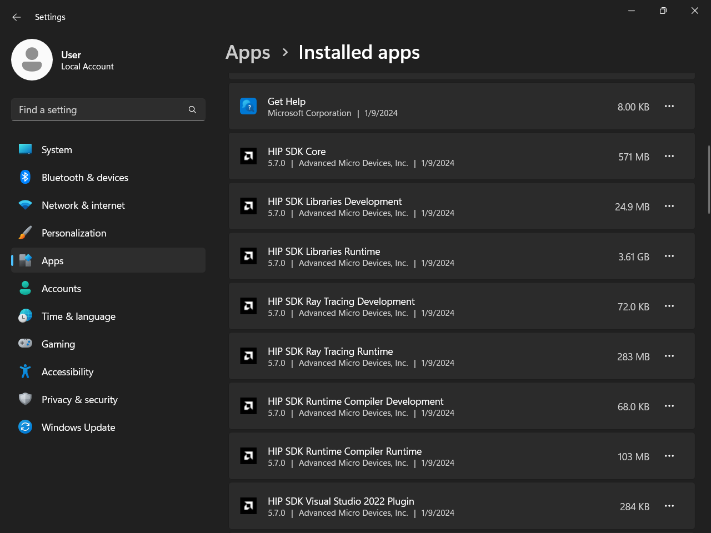
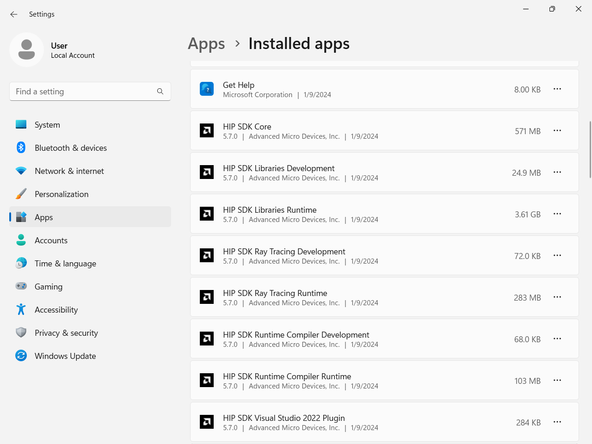

.. meta::
  :description: Windows quick-start installation guide
  :keywords: ROCm installation, AMD, ROCm, Windows, HIP, HIP SDK

******************
HIP SDK on Windows
******************

The HIP SDK on Windows for ROCm now includes new versions of the
``amdhip64`` and ``amd_comgr`` binaries in place of the old binaries:

* ``amdhip64_6.dll`` replaces ``amdhip64.dll``
* ``amd_comgr_2.dll`` replaces ``amd_comgr.dll``

The latest version of HIPRT -- named ``hiprt0200364.dll`` (version 2.3.12a8a07)
-- is included with this release.

To use the latest capabilities of the HIP SDK, reference these new versions of
the DLL files.

.. note::

   The HIP SDK on Windows for ROCm 6.x is not backwards compatible with previous major
   versions such as 5.x.

.. _hip-install-quick:

Windows quick-start installation guide
======================================

For a quick summary on installing HIP SDK on Windows, follow the steps listed on this page. If you
want a more in-depth installation guide, see :ref:`hip-install-full`.

System requirements
-------------------

The HIP SDK is supported on Windows 10 and 11. You can install HIP on a system without AMD GPUs
to use the build toolchains, but to run HIP applications, you'll need a compatible GPU. Refer to
the :doc:`supported GPU guide</reference/system-requirements>` for more details.

HIP SDK installation
--------------------

1. Download the installer.

    Download the installer from the
    `HIP-SDK download page <https://www.amd.com/en/developer/resources/rocm-hub/hip-sdk.html>`_.

2. Launch the installer.

    To launch the AMD HIP SDK Installer, click the **Setup** icon shown in the following image.

    .. image:: ./data/how-to/000-setup-icon.png
        :width: 50
        :alt: Icon with AMD arrow logo and User Access Control Shield overlay

    The installer requires Administrator Privileges, so you may be greeted with a
    User Access Control (UAC) pop-up. Click Yes.

    .. image:: ./data/how-to/001-uac-dark.png
        :class: only-dark
        :width: 400
        :alt: User Access Control pop-up

    .. image:: ./data/how-to/001-uac-light.png
        :class: only-light
        :width: 400
        :alt: User Access Control pop-up

    The installer executable will temporarily extract installer packages to `C:\\AMD`, which it removes
    after completing the installation. You'll see the "Initializing install" window during extraction.

    .. image:: ./data/how-to/002-initializing.png
        :width: 400
        :alt: Window with AMD arrow logo, futuristic background and progress counter

    The installer will then detect your system configuration to determine which installable components
    are applicable to your system.

    .. image:: ./data/how-to/003-detecting-system-config.png
        :width: 400
        :alt: Window with AMD arrow logo, futuristic background and activity indicator

3. Customize the install.

    When the installer launches, it displays a window that lets you customize the installation. By default,
    all components are selected for installation.

    .. image:: ./data/how-to/004-installer-window.png
        :width: 400
        :alt: Window with AMD arrow logo, futuristic background and activity indicator

    a. HIP SDK installer

        The HIP SDK installation options are listed in the following table.

        .. csv-table::
            :widths: 30, 30, 40
            :header: "HIP components", "Install type", "Additional options"

            "HIP SDK Core", |win_rocm_version|, "Install location"
            "HIP Libraries", "Full, Partial, None", "Runtime, Development (Libs and headers)"
            "HIP Runtime Compiler", "Full, Partial, None", "Runtime, Development (headers)"
            "HIP Ray Tracing", "Full, Partial, None", "Runtime, Development (headers)"
            "Visual Studio Plugin", "Full, Partial, None", "Visual Studio 2017, 2019, 2022 Plugin"

        .. note::
            The ``select``/``deselect all`` options only apply to the installation of HIP SDK components. To
            install the bundled AMD Display Driver, manually select the install type.

        .. tip::
            Should you only wish to install a few select components, deselecting all, then selecting
            individual components may be more convenient.

    b. AMD display driver

        The HIP SDK installer bundles an AMD Radeon Software PRO |radeon_software_pro_version| installer.
        The supported install options and types are summarized in the following tables:

        .. csv-table::
            :widths: 30, 70
            :header: "Install option", "Description"

            "Install Location", "Location on disk to store driver files."
            "Install Type", "The breadth of components to be installed."
            "Factory Reset (optional)", "A Factory Reset will remove all prior versions of AMD HIP SDK and drivers. You will not be able to roll back to previously installed drivers."

        .. csv-table::
            :widths: 30, 70
            :header: "Install type", "Description"

            "Full Install", "Provides all AMD Software features and controls for gaming, recording, streaming, and tweaking the performance on your graphics hardware."
            "Minimal Install", "Provides only the basic controls for AMD Software features and does not include advanced features such as performance tweaking or recording and capturing content."
            "Driver Only", "Provides no user interface for AMD Software features."

        .. note::

            You must perform a system restart for a complete installation of the Display driver.

4. Install components.

    Please wait for the installation to complete as shown in the following image.

    .. image:: ./data/how-to/012-install-progress.png
            :width: 400
            :alt: Window with AMD arrow logo, futuristic background and progress meter

5. Complete installation.

    Once the installation is complete, the installer window may prompt you for a system restart. Click
    **Restart** at the lower right corner, shown in the following image.

    .. image:: ./data/how-to/013-install-complete.png
        :width: 400
        :alt: Window with AMD arrow logo, futuristic background and completion notice

    .. note::
        If the installer terminates mid-installation, you can safely remove the temporary directory created
        under `C:\\AMD`. Installed components don't depend on this folder unless you explicitly chose
        this as the install folder.

Uninstall
---------

All components, except the Visual Studio plug-in, should be uninstalled through Control Panel >
Add/Remove Program. You can uninstall HIP SDK components through the Windows Settings app.
Navigate to "Apps > Installed apps", click the ellipsis (...) on the far right next to the component you
want to uninstall, then click "Uninstall".

