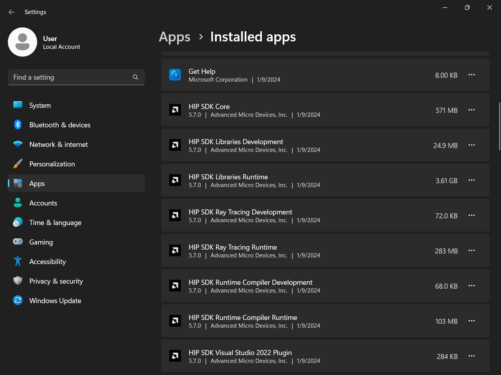
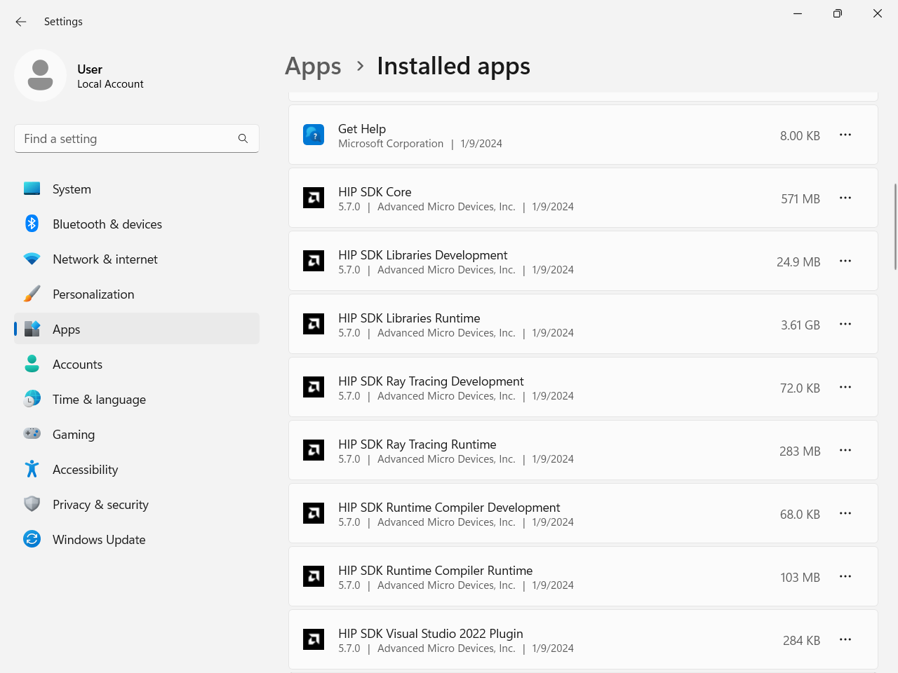

.. meta::
   :description: Install HIP SDK
   :keywords: Windows, install, HIP, SDK, ROCm, AMD, HIP SDK

.. _hip-install-full:

*******************************************************************
Install HIP SDK
*******************************************************************

To install the HIP SDK on Windows, use the :ref:`hip-install-quick` or the instructions in :ref:`hip-cli-install`. See :ref:`system-requirements-win` for more information on the required environment.  

.. _hip-install-quick:

HIP SDK quick start installation
================================

For a quick summary on installing the HIP SDK on Windows, follow the steps listed on this page. 

1. Download the installer.

   Download the installer from the
   `HIP SDK download page <https://www.amd.com/en/developer/resources/rocm-hub/hip-sdk.html>`_.

   The download page lists supported OSes for different available ROCm versions,
   with a link to download the related installer. Select the download file matching
   the ROCm version you want to install. 
   
   Clicking the HIP SDK download link takes you to a license page that you must
   accept before the download will begin. Specify the location to save the download
   file to. 

2. Launch the installer.

   To launch the AMD HIP SDK Installer, click the **Setup** icon shown in the following image.

   .. image:: ../data/install/000-setup-icon.png
      :width: 50
      :alt: Icon with AMD arrow logo and User Access Control Shield overlay

   The installer requires Administrator Privileges, so you may be greeted with a
   User Access Control (UAC) pop-up. Click Yes.

   .. image:: ../data/install/001-uac-dark.png
      :class: only-dark
      :width: 400
      :alt: User Access Control pop-up

   .. image:: ../data/install/001-uac-light.png
      :class: only-light
      :width: 400
      :alt: User Access Control pop-up

   The installer executable will temporarily extract installer packages to ``C:\AMD``, which it removes
   after completing the installation. You'll see the "Initializing install" window during extraction.

   .. image:: ../data/install/002-initializing.png
      :width: 400
      :alt: Window with AMD arrow logo, futuristic background and progress counter

   The installer will then detect your system configuration to determine which installable components
   are applicable to your system.

   .. image:: ../data/install/003-detecting-system-config.png
      :width: 400
      :alt: Window with AMD arrow logo, futuristic background and activity indicator

3. Customize the install.

   When the installer launches, it displays a window that lets you customize the installation. By default,
   all components are selected for installation.

   .. image:: ../data/install/004-installer-window-620.png
      :width: 400
      :alt: Window with AMD arrow logo, futuristic background and activity indicator

   a. HIP SDK installer

      The HIP SDK installation options are listed in the following table.

      .. csv-table::
         :widths: 30, 30, 40
         :header: "HIP components", "Install type", "Additional options"

         "HIP SDK Core", 7.1.1, "Install location"
         "HIP Libraries", "Full, Partial, None", "Runtime, Development (Libs and headers)"
         "HIP Runtime Compiler", "Full, Partial, None", "Runtime, Development (headers)"
         "HIP Ray Tracing", "Full, Partial, None", "Runtime, Development (headers)"
         "`Visual Studio Plugin <https://rocm.docs.amd.com/projects/hip-vs/en/latest/>`_", "Full, Partial, None", "Visual Studio 2017, 2019, 2022 Plugin"
         "AMD ROCm Debugger", "Full, Partial, None", "AMD ROCm Debugger (ROCgdb)"

      .. note::

         The ``select``/``deselect all`` options only apply to the installation of HIP SDK components. To
         install the bundled AMD Display Driver, manually select the install type.

      .. tip::

         Should you only wish to install a few select components, deselecting all, then selecting
         individual components may be more convenient.

   b. AMD display driver

      The HIP SDK installer bundles an AMD Radeon Software PRO 25.30 installer.
      The supported install options and types are summarized in the following tables:

      .. csv-table::
         :widths: 30, 70
         :header: "Install option", "Description"

         "Install Location", "Location on disk to store driver files."
         "Install Type", "The breadth of components to be installed."
         "Factory Reset (optional)", "A Factory Reset will remove all prior versions of AMD HIP SDK and drivers. You will not be able to roll back to previously installed drivers."

      .. csv-table::
         :widths: 30, 70
         :header: "Install type", "Description"

         "Full Install", "Provides all AMD Software features and controls for gaming, recording, streaming, and tweaking the performance on your graphics hardware."
         "Minimal Install", "Provides only the basic controls for AMD Software features and does not include advanced features such as performance tweaking or recording and capturing content."
         "Driver Only", "Provides no user interface for AMD Software features."

      .. note::

         You must perform a system restart for a complete installation of the Display driver.

4. Install components.

   Please wait for the installation to complete as shown in the following image.

   .. image:: ../data/install/012-install-progress.png
      :width: 400
      :alt: Window with AMD arrow logo, futuristic background and progress meter

5. Complete installation.

   After the installation is complete, the installer window might prompt you for a system restart. Click **Finish** or **Restart** in the lower-right corner, as shown in the following image.

   .. image:: ../data/install/013-install-complete.png
      :width: 400
      :alt: Window with AMD arrow logo, futuristic background and completion notice

   .. note::

      If the installer terminates mid-installation, you can safely remove the temporary directory created
      under ``C:\AMD``. Installed components don't depend on this folder unless you explicitly chose this as the install folder.

.. _hip-cli-install:

HIP SDK command line installation
=================================

The following information provides instructions for installing from the command line. To start the installation, follow these steps:

1. Download the installer from the
`HIP-SDK download page <https://www.amd.com/en/developer/resources/rocm-hub/hip-sdk.html>`_.

2. Launch the installer. Note that the installer is a graphical application with a ``WinMain`` entry
point, even when called on the command line. This means that the application lifetime is tied to a
window, even on headless systems where that window may not be visible.

..  code-block:: shell

    Start-Process $InstallerExecutable -ArgumentList $InstallerArgs -NoNewWindow -Wait

.. important::

    Running the installer requires Administrator privileges.

Command line options are listed in the following table:

.. csv-table::
    :widths: 30, 70
    :header: "Install option", "Description"

    "``-install``", "Command used to install packages, both driver and applications. No output to the screen."
    "``-install -boot``", "Silent install with auto reboot."
    "``-install -log <absolute path>``", "Write install result code to the specified log file. The specified log file must be on a local machine. Double quotes are needed if there are spaces in the log file path."
    "``-uninstall``", "Command to uninstall all packages installed by this installer on the system. There is no option to specify which packages to uninstall."
    "``-uninstall -boot``", "Silent uninstall with auto reboot."
    "``/?`` or ``/help``", "Shows a brief description of all switch commands."

.. note::

    Unlike the GUI, the CLI doesn't support selectively installing parts of the SDK bundle.

To install all components:

..  code-block:: shell

    Start-Process ~\Downloads\Setup.exe -ArgumentList '-install','-log',"${env:USERPROFILE}\installer_log.txt" -NoNewWindow -Wait

.. _env-setup:

Setup the Windows environment
=============================

To run HIP SDK on the Windows environment, you must use the following steps:

1. Add HIP installation to the ``$PATH`` of the to the ``System`` variables using the ``System Properties -> Environment Variables -> Path -> Add`` command:

.. code:: bash
    
    C:\Program Files\AMD\ROCm\7.1\bin

You can also set it for a new terminal using the following command:

.. code:: bash
    
    $env:PATH += ;C:\\Program Files\\AMD\\ROCm\\7.1\\bin
    echo $PATH

2. Use ``hipconfig`` or ``hipInfo`` to test the installation and make sure the commands are loaded:

.. code:: bash

    hipInfo
    hipconfig

.. _hip-upgrade:

Upgrade HIP SDK
===============================================

To upgrade the HIP SDK, you can run the installer for the newer version without uninstalling the
existing version. You can also uninstall the HIP SDK before installing the newest version.

.. _hip-uninstall:

Uninstall HIP SDK
===============================================

All components, except the Visual Studio plug-in, should be uninstalled through Control Panel >
Add/Remove Program. You can uninstall HIP SDK components through the Windows Settings app.
Navigate to "Apps > Installed apps", click the ellipsis (...) on the far right next to the component you
want to uninstall, then click "Uninstall".

.. tab-set::

    .. tab-item:: CLI
        :sync: cli

        Launch the installer. Note that the installer is a graphical application with a ``WinMain`` entry
        point, even when called on the command line. This means that the application lifetime is tied to a
        window, even on headless systems where that window may not be visible.

        ..  code-block:: shell

            Start-Process $InstallerExecutable -ArgumentList $InstallerArgs -NoNewWindow -Wait

        .. important::

            Running the installer requires Administrator privileges.

        To uninstall all components, use the following code:

        ..  code-block:: shell

            Start-Process ~\Downloads\Setup.exe -ArgumentList '-uninstall' -NoNewWindow -Wait

    .. tab-item:: GUI
        :sync: gui

        Uninstallation of HIP SDK components can be done through the Windows Settings app. Navigate to
        "Apps > Installed apps" and click the ellipsis (...) on the far right next to the component you want to uninstall. Click "Uninstall".

        .. image:: ../data/install/014-uninstall-light.png
            :class: only-light
            :width: 400
            :alt: Installed apps section of the settings app showing installed HIP SDK components

        .. image:: ../data/install/014-uninstall-dark.png
            :class: only-dark
            :width: 400
            :alt: Installed apps section of the settings app showing installed HIP SDK components
